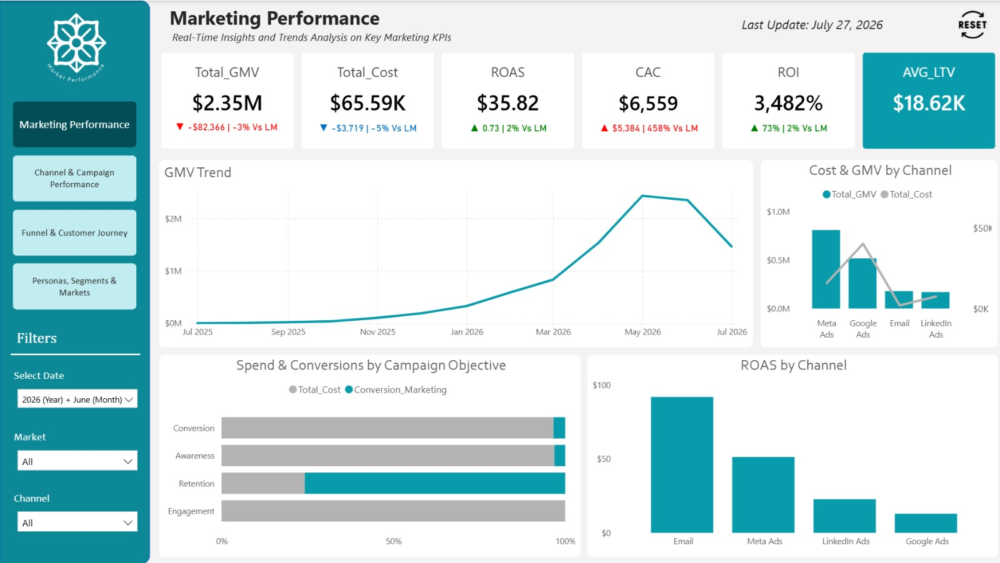
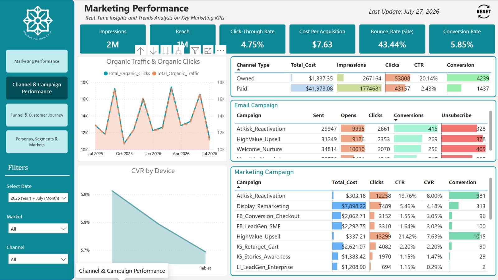
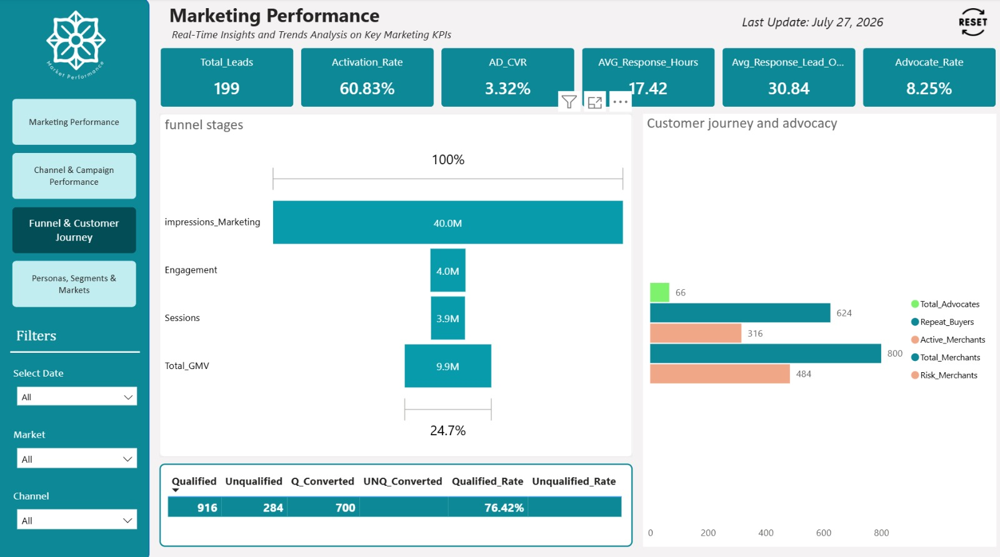
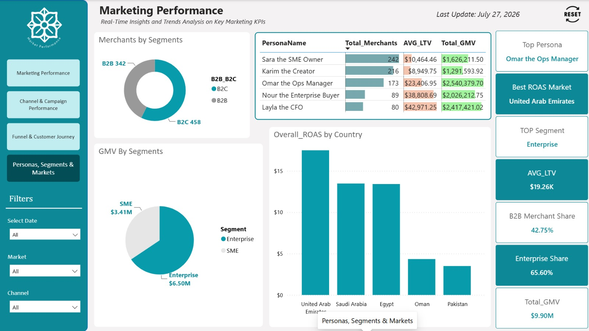

📊 Marketing Analytics --- Power BI Dashboard

A complete Marketing Analytics solution built with Power BI to evaluate marketing performance, campaign effectiveness, customer journey, funnel conversion, channel efficiency, and merchant segments.

The project focuses not only on dashboard design, but also on Data Modeling, DAX, KPI development, business logic, and actionable insights.

🎯 Project Objective

The main objective is to transform marketing, customer, campaign, and merchant data into a centralized analytical solution that helps answer questions such as:

How is overall marketing performance changing over time?

Which channels and campaigns generate the best results?

How efficiently are users moving through the marketing funnel?

Which customers and merchant segments generate the most value?

Which markets and personas show the strongest performance?

Where are the main opportunities and risks?

🛠️ Tools & Technologies

Excel 

Power Query (Data Cleaning & Transformation)

Power BI

DAX

Data Modeling

Business Intelligence & Visualization

📑 Dashboard Pages

1. Marketing Performance

The executive overview of the marketing business performance.

Main KPIs

Total GMV

Total Marketing Cost

ROAS

CAC

ROI

Average LTV

Analysis

GMV trend over time

Cost vs GMV by channel

Spend & conversions by campaign objective

ROAS by channel

Month-over-month KPI comparisons

2. Channel & Campaign Performance

This page focuses on understanding how different marketing channels and
campaigns perform.

Main Metrics

Impressions

Reach

CTR

CPA

Bounce Rate

Conversion Rate

Clicks

Conversions

Analysis

Paid vs Owned channel performance

Campaign-level cost and conversion analysis

CTR and CVR comparison

Email campaign performance

Organic traffic and organic clicks

CVR by device

3. Funnel & Customer Journey

This page analyzes the customer journey from initial exposure to
conversion and retention.

Funnel Stages

Impressions → Engagement → Sessions → GMV

Customer Journey Analysis

Active Merchants

Repeat Buyers

Risk Merchants

Advocates

Qualified vs Unqualified Leads

Conversion performance

The goal is to identify where the largest drop-offs happen and where
customer retention opportunities exist.

4. Personas, Segments & Markets

This page focuses on customer and merchant segmentation to understand
where business value is coming from.

Analysis

Merchant distribution by segment

GMV by segment

Average LTV by persona

GMV by persona

ROAS by country

B2B vs B2C merchant share

Enterprise vs SME contribution

Key Questions

Which persona generates the highest GMV?

Which segment has the highest customer value?

Which markets deliver the strongest ROAS?

How much of the business comes from Enterprise merchants?

🧩 Data Modeling

One of the main learning areas of this project was building a reliable
Data Model rather than simply connecting tables.

The model was designed around concepts such as:

Fact & Dimension tables

Star Schema

Relationships & Filter Propagation

Grain of Fact Tables

Active & Inactive Relationships

Bridge Tables

Role-Playing Dimensions

Normalization & Denormalization

Single Source of Truth

Metric Consistency

The goal was to make sure that filters, calculations, and KPIs behave
consistently across the report.

📈 KPI & Business Logic

The dashboard includes business-focused KPIs such as:

KPI              Purpose

GMV              Measures total transaction value
Marketing Cost   Measures marketing spending
ROAS             Measures revenue generated per unit of marketing spend
CAC              Measures customer acquisition cost
ROI              Measures return relative to marketing investment
LTV              Measures customer/merchant lifetime value
CTR              Measures click engagement
CVR              Measures conversion efficiency
CPA              Measures cost per acquisition

Month-over-month comparison indicators were also implemented to make
changes in performance easier to identify.

💡 Key Business Insights

Marketing Performance

GMV reached $2.35M in June 2026, down 3% from the previous
month.

Marketing Cost decreased by 5%, helping ROAS improve by 2%.

CAC increased significantly, highlighting a potential customer
acquisition efficiency issue.

ROI remained very high at 3,482%.

Channel & Campaign Performance

Paid channels accounted for most marketing spending.

Owned channels achieved a much higher CTR and generated more
conversions despite significantly lower spending.

HighValue_Upsell and AtRisk_Reactivation were among the
strongest campaigns by conversions.

AtRisk_Reactivation achieved an 8% CVR among the campaigns
shown.

Funnel & Customer Journey

The largest funnel drop occurs between Impressions and
Engagement.

Sessions remain relatively close to Engagement volume.

The business has a strong base of Repeat Buyers, while Risk
Merchants represent an important retention opportunity.

Personas, Segments & Markets

Omar the Ops Manager generated the highest GMV among the
personas shown.

Layla the CFO had the highest Average LTV.

Enterprise generated the largest share of GMV.

United Arab Emirates showed the strongest ROAS among the
displayed markets.

B2B represented approximately 42.75% of the merchant base.

📚 Documentation

A detailed step-by-step documentation is included in the repository
covering the project workflow, data preparation, modeling decisions, KPI
development, DAX logic, dashboard construction, and analytical insights.

📚 **Documentation:** [View Step-by-Step Documentation](Documentation_Step_by_Step.md)

💡 **Insights:** [View Marketing Insights](Marketing_Analytics_Insights.txt)

🚀 Project Outcome

This project demonstrates how Power BI can be used to move from raw
marketing data to a structured analytical solution:

Data → Data Model → Business Logic → KPIs → Visualization → Insights →
Business Decisions

The main lesson from the project was that a dashboard can look
excellent, but if the underlying Data Model is incorrect, the resulting
KPIs and insights can also be misleading.

👤 Author

Mohamed Hesham

Data Analyst | Power BI 
